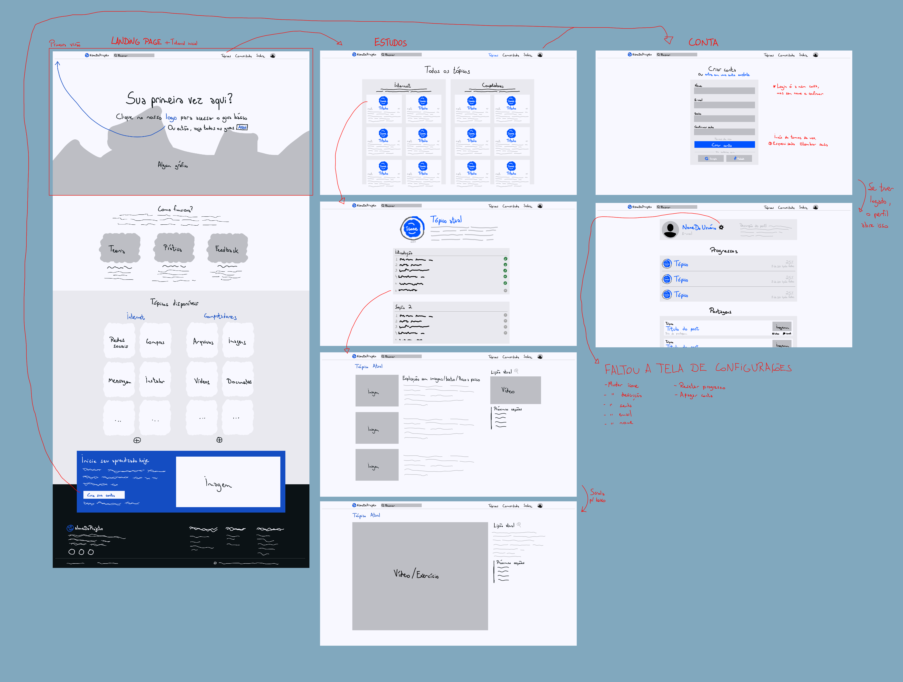

# Plataforma de aprendizado digital - Chave Digital

## Instruções de instalação e execução

### Baixando o projeto  

Antes de acessar o projeto, é primeiro necessário baixar os arquivos, para isso você pode clicar no botão "Code" e então em "Download ZIP", ou então usando o terminal, executar o comando "git clone https://github.com/Rafael-Kendy/desenvolvimento-web.git". Caso tenha baixado o ZIP, extraia os arquivos para um pasta.

Abra o terminal dentro da pasta que você baixou, "cd {CAMINHO DA PASTA}". 

### Executando o HTML

Navegue para o branch HTML, "git checkout html", em caso de dúvida use o comando "git branch -r" para mostrar o nome de todos os branches.

Você pode abrir cada página separadamente usando "start {NOME DA PÁGINA}" no Windows ou "xdg-open {NOME DA PÁGINA}", usar "ls" na pasta do projeto irá listar todos os arquivos.

Caso você tenha python instalado em seu computador, o comando "python3 -m http.server" irá criar um servidor simples que pode ser acessado em seu navegador usando o link "http://localhost:8000". Se você possui a IDE VSCode, todo esse processo pode ser feito via o terminal dentro da IDE, além disso com a extensão Live Server, você pode clicar com o botão direito no arquivo "index.html" e em "Abrir com Live Server" para abrir o projeto automáticamente no seu navegador.

### Executando o React

Você precisa ter instalado no seu computador node.js e npm.

Navegue para o branch React, usando "git checkout react" e a partir da pasta baixada, vá para o diretório "cd v2-comReact/projeto-ihc/".

Execute o comando "npm install" para baixar as dependências do projeto e então "npm run dev", isso abrirá um servidor onde você poderá acessar o projeto. Normalmente ele usa o endereço "http://localhost:5173/".

## Estrutura do projeto

Este projeto foi desenvolvido como uma plataforma de alfabetização digital, com foco em acessibilidade, colaboração e aprendizado aberto. A ideia é oferecer um ambiente simples e intuitivo, onde qualquer pessoa possa aprender a usar computadores e a internet por meio de textos, imagens, vídeos e exercícios práticos.

A plataforma seria sem fins lucrativos e de código aberto, permitindo que qualquer pessoa contribua com melhorias, correções, novas lições ou materiais complementares. Dessa forma, buscamos criar um recurso vivo e em constante evolução, apoiado pela comunidade.

Nosso GitHub possui três branches no momento.
- Main: possui o site mais atualizado, se você está lendo esta mensagem, você já está aqui.
- HTML: versão do site usando apenas HTML, CSS e JavaScript. Apenas um arquivo CSS foi utilizado, ele pode ser encontrado em "css/style.css". O arquivo JS está em "js/main.js" e é utilizado para abrir o modal do cabeçalho e carregar o cabeçalho e rodapé nas páginas que faz uso desses componentes. A pasta "assets" inclui os HTMLs desses 2 componentes, assim como as imagens e outros documentos utilizados.
- React: evolução do HTML, nele o site foi refeito usando React e JSX, dividindo as páginas em componentes e facilitando seu reúso na criação de novas páginas. Os arquivos "index.html" e "src/main.jsx" servem como porta de entrada para o site. "src/App.jsx" seria o nosso "index.html" original. As páginas ficam em "src/pages" e os componentes utilizadas nelas pode ser encontrado em "src/components".

O projeto foi desenvolvido seguindo uma certa identidade visual, com a intenção de facilitar a sua navegação, o rascunho inicial dessa identidade é visto na imagem abaixo.

A divisão de tarefas entre os 3 membros da equipe foi feita de maneira em que todos tivessem um número equivalente de páginas a desenvolver.
- Hugo Massaro: telas de criação de conta, login, perfil e configurações.
- Rafael Kendy: telas inicial, sobre, equipe e diretrizes. Componentes do cabeçalho e rodapé.
- Rafael Zaupa: telas com todos os tópicos, a individual de cada tópico e todas as lições desses tópicos.

Embora essa divisão de tarefas tenha sido feita, ela serviu apenas como um guia geral, não significando que cada membro trabalhou apenas em suas páginas. Durante o desenvolvimento do projeto tentamos estar sempre em comunicação, atualizando uns aos outros em que partes estávamos trabalhando e se ajudando conforme necessário.

## Explicação de cada página e suas funcionalidades

### index.html - Página inicial

Primeiro contato do usuário com a plataforma, possui uma breve introdução de como ela funciona e alguns dos tópicos de estudo. Através dela também é possível criar uma conta e clicando no logo do site existe um popup para ajuda básica quanto aos componentes interativos.

### sobre.html - Sobre a Chave Digital

Explicação mais detalhada sobre nossos objetivos e como o projeto funciona. Também contém as referências usadas na criação do site e uma área para que o usuário colabore com o projeto.

### diretrizes.html - Nossas diretrizes

Contém o enunciado referente a primeira entrega do projeto.

### equipe.html - Nossa equipe

Breve introdução da nossa equipe que fez o desenvolvimento do site.

### topicos_todos.html - Todos os tópicos

Porção do site onde ficarão em disposição os assuntos, mostrando alguns dos tópicos cobertos dentro de cada tema.

### internet.html, computadores.html, mensagens.html - Tópicos individuais

Dentro de ../topics. Onde onde estão reunidos as páginas do fluxo de navegação do site a partir da escolha do tópico que o usuário deseja estudar. Aqui estão os arquivos .html referentes a cada um dos tópicos disponíveis. Os tópicos foram escolhidos para demonstração, e não serão limitados a estes.

### pg_rede.html - Lição

Dentro de ../topics/internet, uma das lições propriamente ditas. São compostas por imagens, passo-a-passo e vídeo quando disponível, bem como as próximas lições ou próximo tópico, em ordem. A página referente a cada uma das lições pode ser encontrada na pasta de seu respectivo tópico, como em ../topics/computadores e ../topics/mensagens.

